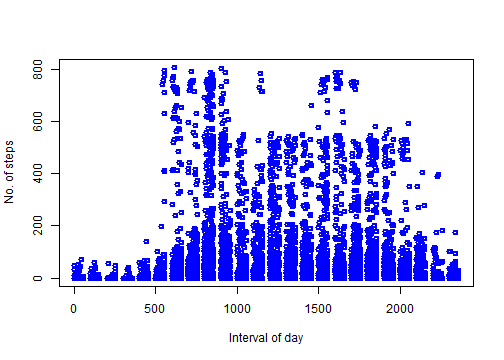

## Exploring Daily Activity Numbers

<H3> Developing Data Products Class Project </h3>

--- .class #id 

## Daily Activity Monitoring Data

<P>During the Reproducible Research class of the Data Science track, the class project involved data gathered by a personal activity tracking device.  </p>
<p>The device recorded the number of steps the research subject took in each five-minute interval of the day for 61 days. </P>

--- .class #id 

## App Features

* This app allows the user to choose a single day of the week, the weekdays Monday through Friday, or the weekend days Saturday and Sunday.  
* It plots the average number of steps taken in each interval over all the instances of the chosen day or day range.
* It also plots the histogram of the average number of steps vs. intervals.

--- 

## App Features, 2: 

For example, this plot shows the unedited data for all days:


```r
actdata <- read.csv("activity.csv")
plot(actdata$interval, actdata$steps, col = "blue", lwd = 2, ylab = "No. of steps", 
    xlab = "Interval of day")
```

 

--- 
## App Features, 3:

* The app allows the user to guess at the mean number of steps per interval the test subject has taken and superimposes the guessed mean value on the line plot and histogram.  
* It then shows the user how far the guess is off by.
* The app also allows the user to guess at the total number of steps taken during a typical example of the chosen day.
* It also shows how far this guess is off by using a statement.


